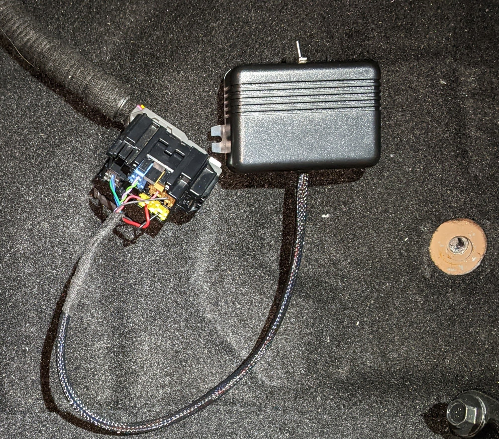
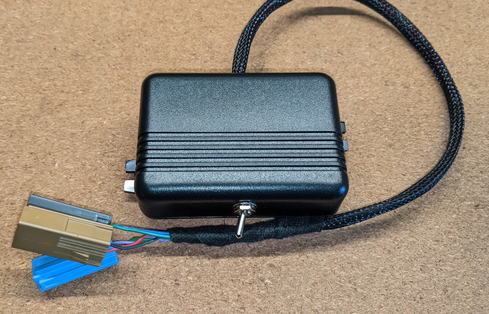
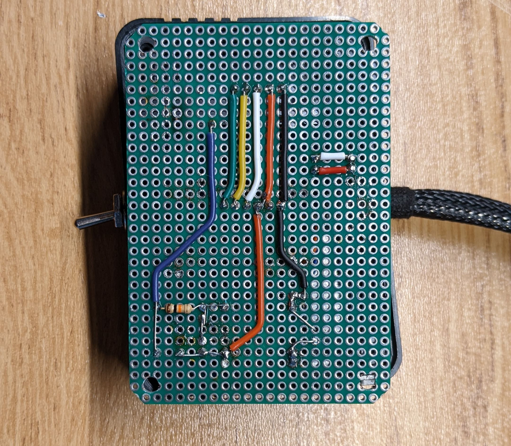
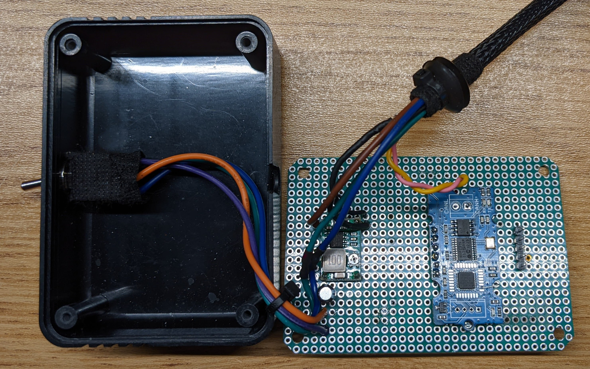
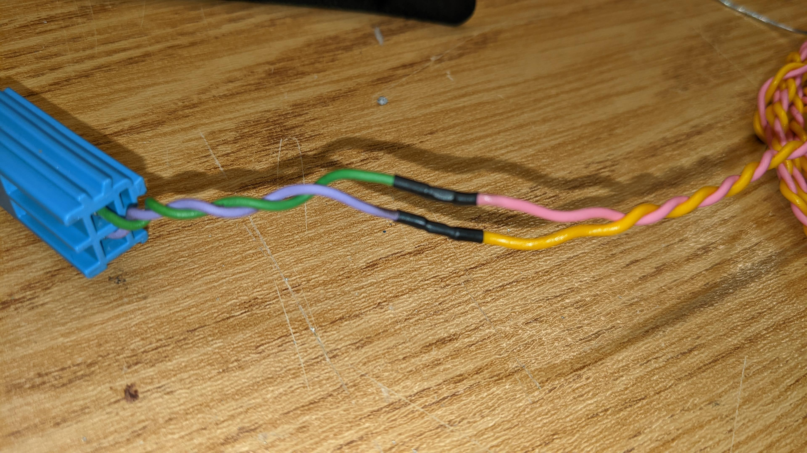

# Mazda MX-5 ND Passenger Occupancy Sensor Emulator

    

## Description

This is an emulator of the MX-5 ND passenger occupancy sensor built with Arduino. It can be used when the original OEM sensor is removed from the car together with the seat.

The code has provisions for a switch which can be connected to one of the analog pins (Look for 'PASSENGER_PRESENT_PIN' in code to get the pin number). When there is a passenger in the car, using the switch to send 5V to the pin will to make the emulator send `Passenger Present` signal to the SRS system to let it know that the passenger airbags should deploy in case of an accident. The pin needs to be connected to ground with a pull down resistor (10kΩ or similar).

Additionally, the unit in the pictures uses a DPDT switch and the other pole is used to toggle the seat belt signal. When the occupancy emulator is set to send `Passenger Present` signal, the `Seat Belt On` signal is sent along with it.

The program is a modification of [Timurrrr's "fake car"](https://github.com/timurrrr/RaceChronoDiyBleDevice#testing-with-a-fake-car) which spoofs Mazda MX-5 ND CAN frames. The emulator is built with an alternative module [from Longan Labs](https://docs.longan-labs.cc/1030017/). A version of the emulator built on exactly the same components as Timurrr's is shown [here](https://github.com/chrumck/mx5nd-ocs-emulator/tree/main).

The program uses a modified version of [Arduino_CAN_BUS_MCP2515](https://github.com/chrumck/Arduino_CAN_BUS_MCP2515) library, but should also work with Longan's official, unmodified version.

The emulator needs to be connected [according to this wiring diagram](https://www.mx5manual.com/page.html?p=wiring&s=WR001&docid=SM356447) . The seat belt buckles wiring is [shown here](https://www.mx5manual.com/page.html?p=wiring&s=WR001&docid=SM356446) .

It important that the emulator does not introduce any noise in the car's CAN bus network. The circuit includes a DC-DC 5V inverter and a capacitor to deliver stable power supply. Additionally, it is important that the CAN bus wires are properly twisted and made not too long to avoid interference.

This emulator has been tested and confirmed to be working, but if you run into noise and interference issues which can, among other things, manifest themselves as U0001 errors, you can try to build the module using alternative components.

## Pictures

    

    

    

    

